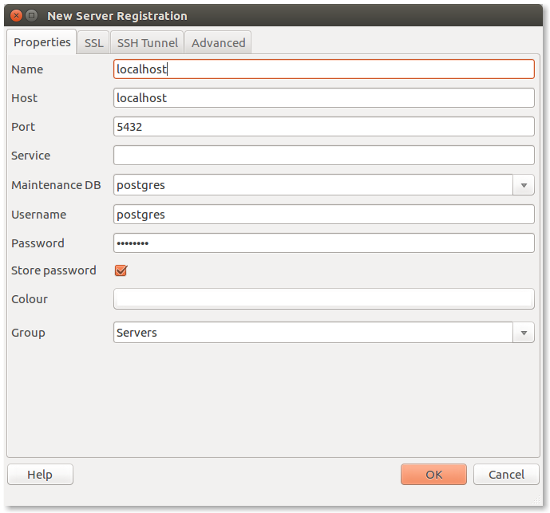

# PostgreSQL installation and configuration

## Introduction

To use databases while programming, first we have to install it on our development machine. As we are learning PostgreSQL, we are going to install and configure it and finally learn a way to access it from Python.

## Installation

Ubuntu's default repositories contain Postgres packages, so we can install these easily using the `**apt**` packaging system.

Since this is our first time using `apt` in this session, we need to refresh our local package index. We can then install the Postgres package and a `‑contrib` package that adds some additional utilities and functionality:
    
    
    [terminal]  
    sudo apt-get update  
    sudo apt-get install postgresql postgresql-contrib

Now that our software is installed, we can go over how it works and how it may be different from similar database management systems you may have used.

## Using PostgreSQL Roles and Databases

By default, Postgres uses a concept called "roles" to handle authentication and authorization. These are, in some ways, similar to regular Unix-style accounts, but Postgres does not distinguish between users and groups and instead prefers the more flexible term "role".

Upon installation Postgres is set up to use **ident** authentication, which means that it associates Postgres roles with a matching Unix/Linux system account. If a role exists within Postgres, a Unix/Linux username with the same name will be able to sign in as that role.

There are a few ways to utilize this account to access Postgres.

### Switching Over to the postgres Account

The installation procedure created a user account called `postgres` that is associated with the default Postgres role. In order to use Postgres, we can log into that account.

Switch over to the `postgres` account on your server by typing:
    
    
    [terminal]  
    sudo -i -u postgres

You can now access psql, the PostgreSQL interactive terminal immediately by typing:
    
    
    [terminal]  
    psql

You will be logged in and able to interact with the database management system right away.

Exit out of the psql prompt by typing:
    
    
    [psql]  
    \q

You should now be back in the Linux command prompt of the `postgres` user. You can use the `exit` command to return to your own user's command prompt.

### Accessing a Postgres Prompt Without Switching Accounts

You can also run the command you'd like with the `postgres` account directly with `sudo`.

For instance, in the last example, we just wanted to get to a Postgres prompt. We could do this in one step by running the single command `psql` as the `postgres` user with `sudo` like this:
    
    
    [terminal]  
    sudo -u postgres psql

This will log you directly into Postgres without the intermediary `bash` shell in between.

Again, you can exit the interactive Postgres session by typing:
    
    
    [psql]  
    \q

### Setting password for the default role

We need to add an extra layer of security, by adding a password to the default role. Also we need a password if we want to connect to the database using a GUI application later. Run:
    
    
    [terminal]  
    sudo -u postgres psql postgres

In the psql prompt, run the following. The password can be anything you like, you just have to remember it (since most people is more familiar with the term _user_ than _role_ , you can use also the `ALTER USER` statement instead of the `ALTER ROLE` \- it's just an alias of it):
    
    
    [psql]  
    ALTER ROLE postgres WITH PASSWORD 'new_password_for_postgres';

### Create a New Role

Currently, we just have the `postgres` role configured within the database. We can create new roles from the command line with the `createuser` command. The `--interactive` flag will prompt you for the necessary values.

If you are logged in as the `postgres` account, you can create a new user by typing:
    
    
    [terminal]  
    createuser --interactive

If, instead, you prefer to use `sudo` for each command without switching from your normal account, you can type:
    
    
    [terminal]  
    sudo -u postgres createuser --interactive

The script will prompt you with some choices and, based on your responses, execute the correct Postgres commands to create a user to your specifications.

In this example, we call this role `codecooler`, but **please use the same username as you have on your laptop!**

Output:
    
    
    [terminal]  
    Enter name of role to add: codecooler  
    Shall the new role be a superusers? (y/n) y

You can get more control by passing some additional flags. Check out the options by looking at the `man` page:
    
    
    [terminal]  
    man createuser  
    

Also add a password to your own user, in order to allow connection with it. The password can be anything you like, you just have to remember it!:
    
    
    [psql]  
    ALTER USER your_user_name WITH PASSWORD 'new_password_for_you';

### Create a New Database

By default, another assumption that the Postgres authentication system makes is that there will be a database with the same name as the role being used to login, which the role has access to.

So if in the last section, we created a user called `codecooler`, that role will attempt to connect to a database which is also called `codecooler` by default. You can create the appropriate database with the `createdb `command.

If you are logged in as the `postgres` account, you would type something like:
    
    
    [terminal]  
    createdb codecooler

If, instead, you prefer to use `sudo` for each command without switching from your normal account, you would type:
    
    
    [terminal]  
    sudo -u postgres createdb codecooler

## Connecting PostgreSQL with Python

To connect to a database from Python code, we will need some packages to help. Install all of them:

### pip

_pip is a package management system used to install and manage software packages written in Python._

Check for wrong version of pip:
    
    
    [terminal]  
    pip -V

If this outputs something like `pip 8.1.2 from /usr/local/lib/python2.7/dist-packages/pip-8.1.2-py2.7.egg (python 2.7)`, then you have a wrong version of pip. To fix it, do the following:
    
    
    [terminal]  
    sudo apt-get purge -y python-pip; sudo rm -rf /usr/local/{lib,bin}/python?.?/*-packages/pip*; sudo rm -rf /usr/local/{lib,bin}/pip*; sudo rm -rf /usr/{lib,bin}/python?.?/*-packages/pip*; sudo rm -rf /usr/{lib,bin}/pip*; sudo rm -rf ~/.local/{lib,bin}/python?.?/*-packages/pip*; sudo rm -rf ~/{lib,bin}/python?.?/*-packages/pip*; sudo rm -rf ~/{lib,bin}/pip*; hash -r; echo "All deleted"  
      
    wget https://bootstrap.pypa.io/get-pip.py  
    sudo python3 get-pip.py

(This will set up pip to be associated with pip3, the package manager for python3. Before that you could only force pip to work with python3 if you executed like `python3.5 -m pip`.)

If you already had the right version of pip, you should upgrade it with the following command:
    
    
    [terminal]  
    pip install --upgrade pip

### psycopg2

This beauty is the name of the Python library, which will help us connecting to a Postgres database.

To install it, run:
    
    
    [terminal]  
    sudo apt-get install python3-dev libpq-dev postgresql-client postgresql-client-common  
    sudo pip install psycopg2

Sweet, we've got our PostgreSQL driver installed! We can now test out the installation by writing a few lines of Python code.

## The connection

Save the following script into a .py file, then try to run it. Don't forget to change the username and password to your own!

## <https://code-embed-lti.herokuapp.com/placement/5i0ewCQ7XildPKu8DFjU>

## Managing the Database

Managing a database from the Terminal only is very difficult and complicated task. There are several graphical tools that can help developers managing a PostgreSQL Database, but the most widely used tool is **pgAdmin** , what you can easily install with the following command:
    
    
    [terminal]  
    sudo apt install pgadmin3

After you installed the application, open it and add a connection to your local server as the following image shows (of course, change "postgres" to your local username and use your own password):

After you successfully connected to your database engine, you can see all the databases and what's inside. As Postgres is a really advanced engine, it has many layers. Look around and find your database:

If you'd like to read further, about how to use pgAdmin 3, [read here](https://www.pgadmin.org/docs/1.4/using.html).
